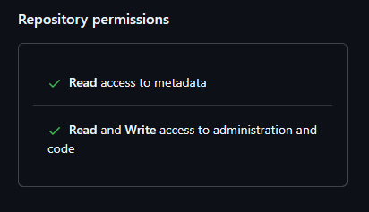

# homelab

Construction d'un cluster Talos dans mon homelab, étapes après étapes

## Installation manuelle

[Avancée commit par commit](https://github.com/sylvainmetayer/homelab/compare/ee54b2647d8cf13275b24dcf34b774b3697ed8c3...ad085471f3f17c4025057885fb43930150991a2c)

## Installation IaC

```
mise plugins add pulumni https://github.com/canha/asdf-pulumi.git
```

### Configuration State pulumi

```
cd pulumi
aws configure # définir access/secret key et `fr-par` en région
pulumi login 's3://pulumi-state?endpoint=https://s3.fr-par.scw.cloud&s3ForcePathStyle=true&region=fr-par'
```

On va récupérer la configuration de notre VMs créé précédement avec la [méthode du provider Proxmox](https://www.pulumi.com/registry/packages/proxmoxve/api-docs/vm/virtualmachine/#look-up)

Avant cela, il faut configurer les crédentials pour se connecter à Proxmox : https://www.pulumi.com/registry/packages/proxmoxve/installation-configuration/

On commence par créer un token dans Proxmox (TODO screen, ne pas cocher `provileges separation`, sinon, le token n'a aucun droit) puis on stocke les identifiants dans le state pulumi

```
pulumi config set --secret proxmox_api_token root@pam!pulumi=TOKEN
pulumi config set --secret proxmox_endpoint https://PROXMOX:8006
pulumi up
```

On est capable de récupérer des informations et de communiquer avec Promox, on va pouvoir créer des VMs !

Un fois la configuration ajoutée pour la VM, on peut constater qu'elle est créé dans Proxmox.

On configure donc avec le provider Pulumi notre machineConfig avec notre patch pour démarrer notre cluster Talos. On note ici qu'on a également rajouté un worker.

Côté Pulumi, il est nécessaire de wrapper les outputs dans des promesses pour récupérer les valeurs des IPs. TODO il y a surement une manière plus propre de faire cela => on peut faire de l'async/await

```shell
pulumi up
pulumi refresh 
pulumi up --diff
# FIXME pulumi refresh + import worker boostrap sinon, les boostrap requests sont en double ?
```

Je n'ai pour l'instant pas trouvé comment récupérer les IPs assignées par le DHCP autrement qu'en faisant un premier refresh et ensuite un autre apply. Une option serait de définir les IPs en dur dans la config talos des worker et du control plane.

```

pulumi stack output talosConfig --show-secrets > talosconfig
talosctl kubeconfig -n CONTROL_PLANE_IP
# on peut omettre talosconfig avec la variable d'env TALOSCONFIG, voir mise.toml

talosctl config endpoint CONTROL_PLANE_IP
talosctl config nodes CONTROL_PLANE_IP WORKER_IP

talosctl health -n CONTROL_PLANE_IP 
talosctl dmesg
```

Et on a maintenant un cluster Kubernetes fonctionnel ! 

```
$ kubectl get nodes
NAME       STATUS   ROLES           AGE     VERSION
host-003   Ready    control-plane   3m13s   v1.32.0
host-010   Ready    <none>          3m22s   v1.32.0
```

On va maintenant brancher flux pour automatiser l'installation des ressources du cluter en mode GitOps. Pour l'instant, on va suivre bêtement la [documentation](https://fluxcd.io/flux/get-started/) et on verra plus tard comme automatiser ça.

Pour les permissions du token, il faut à minima ça (en considérant que le dépôt existe déjà) 



```
flux bootstrap github \
  --owner=$GITHUB_USER \
  --repository=homelab \
  --branch=main \
  --path=./clusters/homelab \
  --personal
```

On continue le tuto, et on commit dans notre dossier "clusters/homelab/default" l'application podinfo, qui va automatiquement être rajoutée au cluster. 

Prochaine étape : installer les composants de notre cluster via flux !
