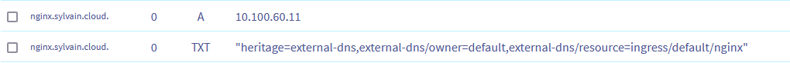
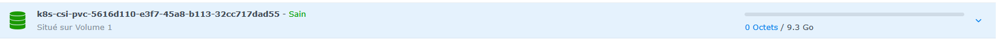

# Installation manuelle Talos

Pré-requis : VM Proxmox configurée avec ISO Talos

```bash
export TALOS_IP=192.168.1.187

talosctl gen secrets
talosctl gen config homelab-test https://$TALOS_IP:6443 --with-secrets ./secrets.yaml --install-disk /dev/sda --config-patch @talos-patch.yaml --force
talosctl get disks --insecure -e $TALOS_IP -n $TALOS_IP
```

```text
NODE   NAMESPACE   TYPE   ID      VERSION   SIZE     READ ONLY   TRANSPORT   ROTATIONAL   WWID   MODEL           SERIAL
       runtime     Disk   loop0   1         4.1 kB   true
       runtime     Disk   loop1   1         684 kB   true
       runtime     Disk   loop2   1         74 MB    true
       runtime     Disk   sda     1         34 GB    false       virtio      true                QEMU HARDDISK
       runtime     Disk   sr0     1         105 MB   false       ata                             QEMU DVD-ROM
```

On veut donc installer Talos sur le disque /dev/sda qui est la plus grande partition.

```bash
# On installe Talos
talosctl apply-config --insecure -n $TALOS_IP -e $TALOS_IP --file controlplane.yaml

# On démarre etcd, cela va prendre quelques minutes le temps de démarrer tous les composants
talosctl bootstrap -e $TALOS_IP --talosconfig ./talosconfig  --nodes $TALOS_IP

# On récupère notre kubeconfig
talosctl kubeconfig  -e $TALOS_IP --talosconfig ./talosconfig  --nodes $TALOS_IP
```

A ce stade, on a un cluster Kubernetes utilisable.

## Test d'un pod basique

```bash
$ k apply -f 01-test-port-forward.yaml
Warning: would violate PodSecurity "restricted:latest": allowPrivilegeEscalation != false (container "nginx" must set securityContext.allowPrivilegeEscalation=false), unrestricted capabilities (container "nginx" must set securityContext.capabilities.drop=["ALL"]), runAsNonRoot != true (pod or container "nginx" must set securityContext.runAsNonRoot=true), seccompProfile (pod or container "nginx" must set securityContext.seccompProfile.type to "RuntimeDefault" or "Localhost")
deployment.apps/nginx created
```

On peut maintenant configurer un port-forward : `kubectl port-forward deployments/nginx 8080:80`

Maintenant que l'on a vu que notre application fonctionne correctement, on peut tenter d'y accéder depuis l'extérieur, en installant un ingress controller. Je vais partir sur l'Ingress Controller NGINX, configuré avec un NodePort

```bash
helmfile init
helmfile apply
k apply -f 02-test-ingress.yaml
curl http://$TALOS_IP:32080/nginx
```

```html
<!DOCTYPE html>
<html>
<head>
<title>Welcome to nginx!</title>
<style>
html { color-scheme: light dark; }
body { width: 35em; margin: 0 auto;
font-family: Tahoma, Verdana, Arial, sans-serif; }
</style>
</head>
<body>
<h1>Welcome to nginx!</h1>
<p>If you see this page, the nginx web server is successfully installed and
working. Further configuration is required.</p>

<p>For online documentation and support please refer to
<a href="http://nginx.org/">nginx.org</a>.<br/>
Commercial support is available at
<a href="http://nginx.com/">nginx.com</a>.</p>

<p><em>Thank you for using nginx.</em></p>
</body>
</html>
```

On accède à notre application depuis l'IP de notre node ! Il nous reste le certificat à gérer, ainsi que la configuration automatique des enregistrements DNS afin de pouvoir déployer notre application de manière plus ou moins automatisée.

Commençons par installer les outils nécessaires pour générer un certificat pour notre ingress. J'utilise la validation ACME DNS avec mon domaine OVH, qui va déclarer un enregistrement DNS pour valider que l'on est bien le propriétaire du domaine. Ainsi, pas la peine d'ouvrir le port 80 pour valider le domaine via HTTP. On installe donc cert-manager et le plugin OVH associé. Pour cela, il faudra bien évidemment avoir des identifants pour interagir avec OVH, on se génère donc une clé d'API [ici](https://www.ovh.com/auth/api/createToken?GET=/*&POST=/*&PUT=/*&DELETE=/*)

```bash
cp values/cert-manager-ovh.EXAMPLE.yaml values/cert-manager-ovh.yaml
# on mets à jour avec son domaine et ses clés d'API
vim values/cert-manager-ovh.yaml

# J'ai essayé de jouer avec les secrets helmfile et une intégration sops, mais n'arrive pas à merger les values et les secrets correctement, on va donc rester sur un fichier en mode gitignore pour l'instant.

# Il faut installer en premier la release cert-manager qui installe les CRDs utilisés par le deuxième chart.
helmfile apply -l module=cert-manager

helmfile apply

```

Il nous reste à modifier notre ingress pour ajouter une annotation et la partie TLS, et notre certificat sera ensuite automatiquement généré par cert-manager.

```bash
k apply -f 02-test-ingress.yaml
```

Quand on regarde les logs de cert-manager, on voit que l'enregistrement est créé et qu'après quelques minutes, notre certificat est disponible !

```
I0303 21:51:07.162136       1 dns.go:90] "presenting DNS01 challenge for domain" logger="cert-manager.controller.Present" resource_name="nginx-sylvain-cloud-tls-1-772529587-1208554888" resource_namespace="default" resource_kind="Challenge" resource_version="v1" dnsName="nginx.sylvain.cloud" type="DNS-01" resource_name="nginx-sylvain-cloud-tls-1-772529587-1208554888" resource_namespace="default" resource_kind="Challenge" resource_version="v1" domain="nginx.sylvain.cloud"
E0303 21:51:07.633314       1 sync.go:208] "propagation check failed" err="DNS record for \"nginx.sylvain.cloud\" not yet propagated" logger="cert-manager.controller" resource_name="nginx-sylvain-cloud-tls-1-772529587-1208554888" resource_namespace="default" resource_kind="Challenge" resource_version="v1" dnsName="nginx.sylvain.cloud" type="DNS-01"
E0303 21:51:07.662802       1 sync.go:208] "propagation check failed" err="DNS record for \"nginx.sylvain.cloud\" not yet propagated" logger="cert-manager.controller" resource_name="nginx-sylvain-cloud-tls-1-772529587-1208554888" resource_namespace="default" resource_kind="Challenge" resource_version="v1" dnsName="nginx.sylvain.cloud" type="DNS-01"
I0303 21:52:20.573016       1 acme.go:236] "certificate issued" logger="cert-manager.controller.sign" resource_name="nginx-sylvain-cloud-tls-1" resource_namespace="default"
```

```
Name:         nginx-sylvain-cloud-tls
Namespace:    default
Labels:       <none>
Annotations:  <none>
API Version:  cert-manager.io/v1
Kind:         Certificate
Metadata:
  Creation Timestamp:  2025-03-03T21:51:05Z
  Generation:          1
  Owner References:
    API Version:           networking.k8s.io/v1
    Block Owner Deletion:  true
    Controller:            true
    Kind:                  Ingress
    Name:                  nginx
    UID:                   4f18dc90-d006-4e69-932e-c960a0b2f37a
  Resource Version:        5784
  UID:                     9735a549-b349-4944-9996-933b4381a10b
Spec:
  Dns Names:
    nginx.sylvain.cloud
  Issuer Ref:
    Group:      cert-manager.io
    Kind:       ClusterIssuer
    Name:       ovh
  Secret Name:  nginx-sylvain-cloud-tls
  Usages:
    digital signature
    key encipherment
Status:
  Conditions:
    Last Transition Time:  2025-03-03T21:52:20Z
    Message:               Certificate is up to date and has not expired
    Observed Generation:   1
    Reason:                Ready
    Status:                True
    Type:                  Ready
  Not After:               2025-06-01T20:53:48Z
  Not Before:              2025-03-03T20:53:49Z
  Renewal Time:            2025-05-02T20:53:48Z
  Revision:                1
Events:
  Type    Reason     Age    From                                       Message
  ----    ------     ----   ----                                       -------
  Normal  Issuing    2m53s  cert-manager-certificates-trigger          Issuing certificate as Secret does not exist
  Normal  Generated  2m53s  cert-manager-certificates-key-manager      Stored new private key in temporary Secret resource "nginx-sylvain-cloud-tls-twvz7"
  Normal  Requested  2m53s  cert-manager-certificates-request-manager  Created new CertificateRequest resource "nginx-sylvain-cloud-tls-1"
  Normal  Issuing    98s    cert-manager-certificates-issuing          The certificate has been successfully issued
```

Il nous reste maintenant à trouver comment définir automatiquement l'enregistrement DNS pour accéder à notre service. Pour cela, nous allons installer ExternalDNS, qui va automatiquement créer les enregistrements DNS. OVH n'étant pas un provider compatible via le [chart helm](https://github.com/kubernetes-sigs/external-dns/tree/master/charts/external-dns#providers), on va suivre la [documentation disponible](https://github.com/kubernetes-sigs/external-dns/blob/master/docs/tutorials/ovh.md)

```bash
cp 03-external-dns.EXAMPLE.yaml 03-external-dns.yaml
# on mets à jour avec son domaine et ses clés d'API
vim 03-external-dns.yaml
k apply -f 03-external-dns.yaml
```

Une fois installé, on peut voir qu'ExternalDNS va directement appliquer les changements de notre domaine par rapport à ce qui été définis dans nos ingress et nos services.

```
time="2025-03-03T22:19:25Z" level=info msg="OVH: 1 zones found"
time="2025-03-03T22:19:26Z" level=info msg="OVH: 9 changes will be done"
time="2025-03-03T22:19:26Z" level=info msg="OVH: 1 zones will be refreshed"
time="2025-03-03T22:20:25Z" level=info msg="OVH: 1 zones found"
time="2025-03-03T22:20:25Z" level=info msg="OVH: 14 endpoints have been found"
time="2025-03-03T22:20:25Z" level=info msg="All records are already up to date"
```

Cependant, l'IP associée à l'enregistrement DNS est l'IP du service, et non mon IP externe.

```
Name:             nginx
Labels:           <none>
Namespace:        default
Address:          10.100.60.11
```



Je n'ai pour l'instant pas trouvé d'autre solution que de définir manuellement l'IP cible souhaitée en tant qu'annotation dans mon ingress afin que la bonne IP soit affectée.

Reste maintenant à configurer le routeur de la box pour rediriger le port 443 vers le port 32443 de notre $TALOS_IP, et nous devrions pouvoir accéder à notre application via internet !

Prochaine brique : la persistence de données. Pour cela, je souhaite utiliser mon NAS (DS216j), qui va pouvoir servir à provisionner de manière dynamique des volumes. Talos propose un [guide](https://www.talos.dev/v1.9/kubernetes-guides/configuration/synology-csi/) pour configurer cela, on va donc le suivre.

TODO : Trouver comment appliquer de manière distante un kustomization

```bash
init.sh
kubectl apply -f external_templates
```

Un inconvénient est que Synology nécessite un compte avec des privilèges administrateurs, comme indiqué sur [cet article](https://faber.sh/Docs/Synology#Setup+CSI+provider+on+OpenShift). Heureusement, il est possible de limiter l'accès, on va donc suivre la procédure décrite dans l'article pour créer l'utilisateur avec des droits restreints, et installer le chart.

```bash
cp values/synology-csi.EXAMPLE.yaml values/synology-csi.yaml
vim values/synology-csi.yaml # définir le mot de passe, nom d'utilisateur et IP du NAS
kubectl create ns synology-csi
kubectl label namespace synology-csi pod-security.kubernetes.io/enforce=privileged
helmfile apply
```

Comme on peut le voir, il est nécessaire d'autoriser le namespace synology a avoir des politiques de sécurité plus permissives, car les droits par défaut sont trop restrictif pour permettre l'installation du chart. On ajoute donc, comme indiqué dans la [documentation](https://www.talos.dev/v1.9/kubernetes-guides/configuration/pod-security/), un label sur le namespace dans lequel on va installer le chart.

Il nous reste à configurer les storageClass et à faire un test pour voir si le provisionnement fonctionne correctement.

```bash
kubectl apply -f 04-storage-class.yaml
kubectl apply -f 05-perfs.yaml
```

On constate alors le résultat suivant si l'on regarde les évènements du namespace `default`:

```text
MountVolume.MountDevice failed for volume "pvc-5616d110-e3f7-45a8-b113-32cc717dad55" : rpc error: code = Internal desc = rpc error: code = Internal desc = Failed to login with target iqn [iqn.2000-01.com.synology:sylvain-data.pvc-5616d110-e3f7-45a8-113-32cc717dad55[], err: nsenter: cannot open /proc//ns/mnt: No such file or directory
```



Dans mon NAS, je vois bien le LUN créé, cependant, on dirait qu'il nous manque quelque chose. Comme indiqué dans la documentation, il faut utiliser une image avec les extensions ISCI installées. Pour cela, se rendre sur [fatory.talos.dev](https://factory.talos.dev/?arch=amd64&cmdline-set=true&extensions=-&extensions=siderolabs%2Fiscsi-tools&platform=nocloud&target=cloud&version=1.9.4) et installer l'image custom. Si comme dans notre cas, on a déjà un Talos d'installé, on peut alors le mettre à jour

```bash
talosctl --talosconfig=./talosconfig upgrade -e $TALOS_IP -n $TALOS_IP --image factory.talos.dev/installer/c9078f9419961640c712a8bf2bb9174933dfcf1da383fd8ea2b7dc21493f8bac:v1.9.4
```

Notre node va alors redémarrer et installer l'extension manquante. On peut alors consulter les logs de nos 2 pods pour voir les performances

```text
# écriture
2147479552 bytes (2.1 GB, 2.0 GiB) copied, 30.4492 s, 70.5 MB/s
# lecture
2147479552 bytes (2.1 GB, 2.0 GiB) copied, 25.2459 s, 85.1 MB/s
```

On est loin de performance extraordinaire, et il est surement possible d'avoir de meilleures performances en configurant mieux le réseau et/ou le chart, cependant, ça fonctionne !

Prochaine étape : Tout supprimer, et réinstaller ça *as code* !
